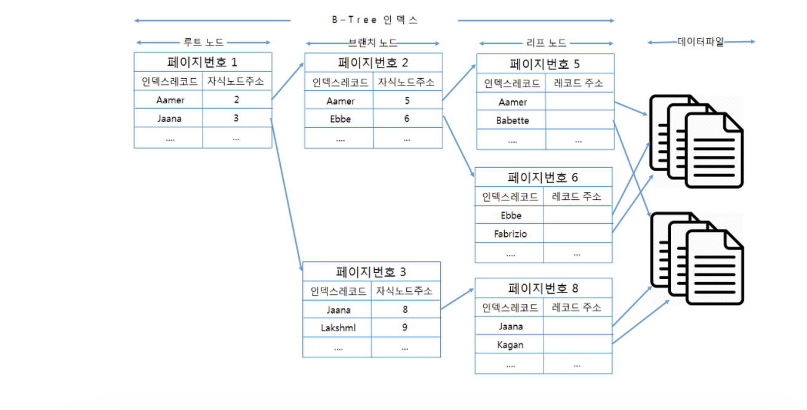

1. 관계형 데이터베이스(RDBMS)와 비관계형 데이터베이스(NoSQL)의 장단점 비교

**RDBMS**
관게형 데이터베이스는 기존 데이터베이스의 `관계형`이라는 키워드가 붙으며 RDB(관계형 데이터베이스)를 관리하는 시스템입니다.

**관계형 데이터베이스의 특징**
> 2차원 형태의 Table이라는 구조를 띄며 이 테이블들은 행(row)과 열(column)으로 이루어져 있습니다. 
> 관계형 데이터베이스는 타 테이블과 관계를 맺는 집합체 특성을 가지며, 이러한 테이블들의 관계(relationship)를 종속적으로 나타냅니다.
> 종속적인 관계는 외래 키(foreign key)를 통해 표현됩니다.

**관계형 데이터베이스의 장점과 한계**

**장점**
- 테이블에 따라 데이터를 저장하므로 명확한 데이터 구조를 보장하여 신뢰도가 높고, 그 때문에 데이터의 무결성이 보장됨
- 데이터의 일관성을 보장
- 데이터의 분류 / 정렬 / 탐색 작업에 대한 속도가 빠르다.
- 파일 기반의 저장방법보다 보안체계가 강력하다.


**한계**
- 스키마에 준수하지 않는 레코드를 추가할 수 없고, 추가적인 컬럼을 삽입하기 위해 테이블의 변경 또는 새로운 테이블생성이 필요
- 관계를 맺고 있기 때문에, JOIN문이 많은 매우 복잡한 쿼리가 만들어 질 수 있다
- 수평적 확장이 어렵고, 대체로 수직적 확장만 가능하다.(즉 처리의 한계를 직면하게됨)
- 대량의 데이터를 입력할 경우나 조회할 경우 성능이 저하 될 수 있고 Sharding과 Replication을 구축하는 비용이 많이 든다

**NOSQL**
Not Only Sql, RDB형태의 데이터 베이스가 아닌 다른 형태의 데이터 저장 기술로, RDBMS와는 달리 테이블 간의 관계를 정의하지 않습니다.
그렇기 때문에 RDB의 특징 중 하나인 타 테이블과의 join 작업도 일반적으로 불가합니다.
빅 데이터의 등장으로 인해 데이터와 트래픽이 기하급수적으로 증가함에 따라 RDBMS에 단점인 성능을 향상시키기 위해 증가

**NOSQL의 특징**
- Key-Value 형태로 저장
  - 데이터가 Key와 Value의 쌍으로 저장
  - Key 값은 어떠한 형태의 데이터도 저장이가능. jpg,mp4도 가능하다.
  - 속도가 빠르며, Redis,Riak,Amazon Dynamo DB등이 존재

- Document Database
  - Key-Value 형태와 유사하지만 Document로 저장된다는점에 차이가 있다.
  - Document는 하나의 객체단위로 취급되며, 계층적인 형태를 띈다.
  - 다만, 기존 SQL과는 다른 쿼리를 사용
  - 대표적인 NOSQL Document model로는 MongoDB,CouthDB등이 있다.

* 데이터의 조회 작업이 기반이 되는 상황에 따라 DB를 선택해야된다.
  * 만약 상세한 조회가 필요로 되는 작업의 경우 RDBMS를 선택해야한다.
  * 많은 데이터 속 필터링의 정보가 적다면 NoSql을 선택해야한다.

2. 트랜잭션(transaction)이란 무엇인가요?

트랜잭션이란 한줄로는 `데이터베이스의 상태를 변화시키기 위해 수행하는 작업 단위`를 뜻합니다. 여러 과정을 하나의 행위로 묶을 때 사용됩니다.
작업의 단위로는 수정,삽입,조회,삭제가 존재합니다.

**트랜잭션의 특징**
- 원자성(Atomicity) : 트랜잭션이 모두 DB에 반영되거나,혹은 전혀 반영되지 않아야합니다.
  - 이를 통해 데이터의 무결성이 보장됩니다.
  
- 일관성(Consistency) : 트랜잭션의 작업 처리 결과는 항상 일관성이 존재해야한다.

- 독립성(Isolation) : 둘 이상의 트랜잭션이 병행실행될 때, 다른 트랜잭션 연산에 끼어들 수 없다.

- 지속성(Durability) : 트랜잭션이 성공적으로 완료되었으면, 결과는 영구적으로 반영되어야함

**트랜잭션의 사용이유**

- 트랜잭션은 DB 서버에 여러개의 클라이언트가 동시에 액세스 하거나 응용 프로그램이 갱신을 처리하는 과정에서 중단될 수 있는 경우 데이터 부정합을 방지 하기위해 사용
- 부정합이 발생하지 않으려면 프로세스를 병렬로 처리하지 않도록 하여 한번에 하나의 프로세스 만을 실행하게 하면되지만 이는 효율성이 떨어진다.
- 즉, 병렬 처리구조 자체를 버릴 순없으니 부정합 방지를 위해 트랜잭션을 사용

3. MySQL에서 조인(join)의 역할은 무엇인가요? 다양한 join의 방식에 대해 설명해주세요.

조인은 두 개이상의 테이블을 묶어 하나의 결과 집합으로 만들어내는 것입니다.즉, 서로 다른 테이블에서 데이터를 가져올 때 사용하는 것이 조인(Join)입니다.

이러한 Join은 총 3가지의 join이 주로 사용됩니다.

**Inner Join(내부 조인)**
조인 중 가장 흔히 사용되는 조인입니다. 기본적으로 아래와 같은 쿼리문을 사용할 때도 Inner JOIN이 사용됩니다.

```sql
USE shopDB
SELECT *
FROM buyTBL
    JOIN userTBL
    ON buyTBL.userID = userTBL.userID
WHERE buyTBL.userID = 'LEE';
```
Inner Join은 대부분 두 table의 교집합을 얘기합니다. 예시로 A와 B가 있다면 A와 B의 교집합을 가져옵니다.

```markdown
A    B
-    -
1    3
2    4
3    5
4    6
```

위와 같은 테이블이 있다면 Inner Join 작업 수행시 3과 4만이 해당하므로 (3,4)만 결과값으로 도출됩니다.

반대되는 개념인 Outer Join은 합집합을 가져오게된다. Outer Join에는 총 3가지의 종류가 존재한다.

Left, Right, Full이다.

Left와 Right는 A와 B를 기준으로 Join할 때 Left Join의 경우 A를 기준으로 합집합을 만든다는 것이고, Right Join의 경우 B를 기준으로 합집합을 만드는 것이다.
Full outer Join의 경우 A와 B의 컬럼을 모두 출력하는 합집합을 만든다.

- LEFT outer Join
```sql
select * from a LEFT OUTER JOIN b on a.a = b.b;
select a.*,b.*  from a,b where a.a = b.b(+);

a |  b
--+-----
1 | null
2 | null
3 |    3
4 |    4
```
- Right outer Join
```sql
select * from a RIGHT OUTER JOIN b on a.a = b.b;
select a.*,b.*  from a,b where a.a(+) = b.b;

a    |  b
-----+----
3    |  3
4    |  4
null |  5
null |  6
```

- Full outer Join
```sql
select * from a FULL OUTER JOIN b on a.a = b.b;

a   |  b
-----+-----
   1 | null
   2 | null
   3 |    3
   4 |    4
null |    6
null |    5
```

흔히들 알고있는 inner와 outer외에도 CROSS JOIN(상호 조인)이 있습니다.


CROSS JOIN은 한쪽 테이블의 행 하나당 다른 쪽 테이블의 모든 행을 하나씩 모든 행들을 각각 조인합니다.

즉, A 테이블의 1번 행을 B 테이블의 1번 행에 조인 시키고, 다음은 A 테이블의 1번 행을 B 테이블의 2번 행에 조인시키고 ...생략... 이를 모든 A 테이블의 행에 각각 모든 B 테이블의 행들에 조인합니다. CROSS JOIN의 결과 행의 개수는 [A 테이블 행의 개수 X B 테이블 행의 개수]가 됩니다.

CROSS JOIN은 카티션 곱(Catesian Product)이라고도 부릅니다

```sql
SELECT * FROM ATable
CROSS JOIN BTable;
```
기본적인 CROSS JOIN 구문입니다. INNER과 OUTER 조인과 달리 ON 구문은 사용하지 않습니다. SELECT * FROM ATable, BTable; 형식으로 작성할 수도 있는데 호환성 등의 이유로 권장되지 않습니다.

SELF JOIN(자체 조인)은 자신에게 조인하는 것입니다. 같은 테이블에 두 번 참조해야 하는 경우도 있습니다.


4. MySQL에서 인덱스(index)란 무엇인가요?

인덱스란 데이터의 읽기 속도를 높여주는 자료구조로, 데이터베이스에서는 테이블의 조회 동작속도를 높여줍니다.
인덱스는 데이터베이스를 구성하는 필수적 요소는 아니나, 데이터베이스의 크기가 커질 수록 필요성은 증가합니다.
그렇기에 인덱스는 데이터베이스의 성능을 크게 좌우하는 요소가 되며, 인덱스를 사용하는 SQL을 만들어 효율적으로 사용한다면 매우 빠른 응답 속도를 얻을 수 있고, 쿼리의 부하가 줄어들기 때문에 시스템 전체 성능이 향상되는 효과를 얻는다.

그러나 인덱스 자체 역시 하나의 데이터 덩어리 이기 때문에, 데이터베이스에 전체 크기의 10%나 되는 추가적인 공간을 할당해줘야 하고, 잘못 사용할 경우 성능이 오히려 크게 떨어질 수 있다는 단점이 있다. (ex. 변경 작업이 자주 일어나는 경우, 인덱스가 적절하지 않은 경우)

때문에 개발자나 관리자들은 효율적인 인덱스 설계로 단점을 최대한 보완하는 구조 방법을 끊임없이 고민해야 한다.

이런 인덱스에는 여러 알고리즘이 존재합니다.

**B-Tree 알고리즘**
mysql에서 사용하는 B-Tree 인덱스는 칼럼의 값을 변형하지 않고, 원래의 값을 이용해 인덱싱하는 알고리즘입니다.

B-Tree 는 최상위에 하나의 루트 노드가 존재하고 그 하위에 자식 노드가 붙어있는 형태입니다.

트리 구조의 가장 하위에는 리프 노드라고 하고 트리구조에서 루트노드도 아니고 리프노드도 아닌 중간의 노드를 브랜치 노드라고 합니다.

이 인덱스의 최대 장점은 어떤 데이터를 조회하든지, 이에 사용하는 조회 과정의 길이 및 비용이 균등 하다는데 있습니다.
단, 어떤 데이터를 조회 하든지 Root 에서 부터 Leaf 페이지를 모두 거처야 하기 때문에 데이터가 적은 테이블등의 단순 조회로 데이터를 조회하는 과정이 대비 조회 속도가 느린 단점이 있습니다.




**Hash 인덱스 알고리즘**
Hash 인덱스 알고리즘은 컬럼의 값으로 해시 값을 계산해서 인덱싱하는 알고리즘으로, 매우 빠른 검색을 지원합니다.

하지만 값을 변형해서 인덱싱하므로, 해시 인덱스는 동등 비교 검색에는 최적화돼 있지만 범위를 검색한다거나 
정렬된 결과를 가져오는 목적으로는 사용 할 수 없으며, 주로 인메모리 DB 에서 사용하는 인덱스 종류입니다. 

